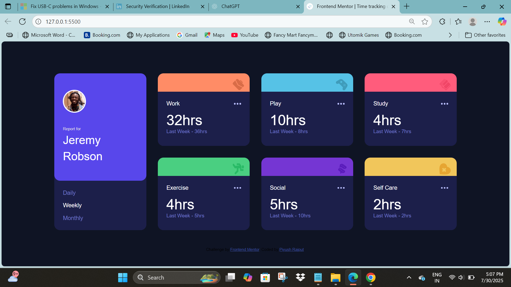

# Frontend Mentor - Time Tracking Dashboard Solution

This is my solution to the [Time Tracking Dashboard challenge](https://time-trackingdashboards.netlify.app/) on Frontend Mentor.

## 📸 Preview

---

## 📌 Table of Contents

- [Overview](#overview)
- [Built With](#built-with)
- [Features](#features)
- [What I Learned](#what-i-learned)
- [Continued Development](#continued-development)
- [Author](#author)

---

## 🧠 Overview

### The Challenge

Users should be able to:

- View the optimal layout for the app depending on their device's screen size (mobile & desktop)
- See hover states for all interactive elements
- Switch between viewing daily, weekly, and monthly stats
- See updated "previous time" labels (e.g. Yesterday, Last Week, Last Month) based on the selected timeframe

### Screenshot

---

## 🛠️ Built With

- Semantic HTML5
- CSS Grid / Flexbox
- Responsive Media Queries
- Vanilla JavaScript
- Mobile-first workflow
- [Frontend Mentor Starter Files](https://www.frontendmentor.io)

---

## 🎯 Features

- Fully responsive layout (mobile and desktop)
- Smooth hover effects and interactions
- Data-driven rendering from `data.json`
- Clean, maintainable CSS using custom utility classes
- Grid-based layout for the dashboard cards

---

## 💡 What I Learned

- How to design a responsive dashboard using CSS Grid and Flexbox.
- Practiced DOM manipulation to dynamically update time data based on selected filter (daily/weekly/monthly).
- Improved accessibility and visual consistency by managing spacing and font hierarchy properly.
- How to visually match static designs using only JPGs.

---

## 🚧 Continued Development

I plan to:

- Add light/dark theme toggle
- Animate transitions between views
- Refactor JavaScript using modern ES6+ modules and better state handling

---

## 👤 Author

- GitHub: [YourUsername](https://github.com/Piyush-Rajput7)
- Frontend Mentor: [@Piyush-Rajput7](https://www.frontendmentor.io/profile/@Piyush-Rajput7)

---

## 🎉 Acknowledgements

Thanks to [Frontend Mentor](https://www.frontendmentor.io) for these great challenges!

